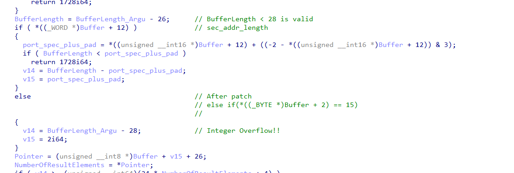

## CVE-2022-26809

This repo just simply research for the CVE, for more detailed ananlysis,please refer [here](http://showlinkroom.me/2022/04/30/Windows-CVE-2022-26809/).   
**UPDATE:05/19 2022**  
This ananlyze hasn't been finished yet....

**UPDATE:05/22 2022**  
[HuanGMz Post](https://paper.seebug.org/1906/) and [corelight blog](https://corelight.com/blog/another-day-another-dce-rpc-rce) show the real vulnerable point:  

`OSF_CASSOCIATION::ProcessBindAckOrNak`  
   

This vulnerability is triggered like [CVE-2021-43893](https://www.rapid7.com/blog/post/2022/02/14/dropping-files-on-a-domain-controller-using-cve-2021-43893/), when send the ESFRPC request to lsass.exe with **UNC path**, victim will try to access target **as client**, so it will trigger interger overflow at **client API**


If have any better solution to trigger this vuln, feel free to submit issue or pr :)

### PoC-CVE-2022-26809
_[refer here](https://paper.seebug.org/1906/)_  

Because the vulnerability triggered like `CVE-2021-43893`, just clone the [PetitPotam](https://github.com/topotam/PetitPotam) code.

Just prepare environment just like here:
  
  

 - trigger: with PetitPotam
 - victim: with Vulnerable rpcrt4.dll
 - attacker: with attacker-server

1. Run `fake_smb_server.py` at attacker-server aflter replacing the rpcrt.py wit origin one(**Because the 445 port has been occupied by System on Windows, it recommend to deploy service on linux **
2. trigger the victim to access attacker serve with
```
python petitpotam.py -pipe lsarpc -method DecryptFileSrv -debug "user:password@victim.ip" "\\attacker.path\realfile
```
3. It will not cause BSOD usually, enable the page heap for `lsass.exe`(_However, I have not success triggered BSoD, but accroding the windbg, the interger overflow has been triggered_)


**Old Description**  
Here is reproduce code for Windows RPC Vuln `CVE-2022-26809`, and it refer [https://github.com/microsoft/Windows-classic-samples/blob/main/Samples/Win7Samples/netds/rpc/hello](https://github.com/microsoft/Windows-classic-samples/blob/main/Samples/Win7Samples/netds/rpc/hello).  

### PoC-OSF_SCALL::GetCoalescedBuffer
_My python version is 3.6.7_
_Not sure if GetCoalescedBuffer will involve real CVE-2022-26809, just keep it_
the `poc.py` just **try** to trigger the vuln function`OSF_SCALL::GetCoalescedBuffer`, it **wouldn't cause any crash because dword integer overflow is too hard to reproduce**.And the `rpcrt.py` is the python package `impacket.dcerpc.v5.rpcrt`，just replace it with origin to trigger vuln(Remember to backup the origin one :) I believe the `rpcrt.py` has a huge of bugs).

If it not work, maybe **wireshark** can help to locate the bug.

#### PipeDemo
if necessary, just use `nmake` to rebuild it